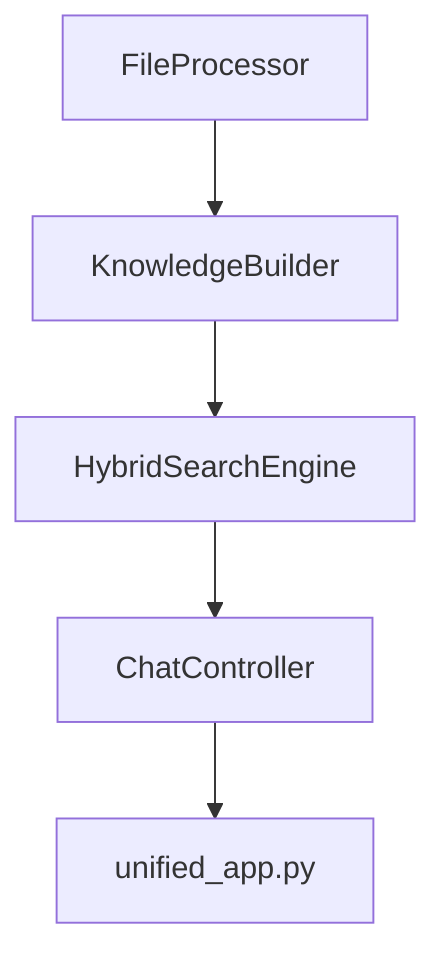

# KnowledgePlus

KnowledgePlus unifies a knowledge base builder with a chatbot interface. The app uses Streamlit and OpenAI embeddings to allow searching, chatting and FAQ generation on your own documents.

## Quick Start

```bash
# install dependencies
pip install -r requirements.txt

# set your OpenAI key
export OPENAI_API_KEY=your_api_key_here

# launch the unified interface
./run_app.sh           # or run_app.bat on Windows
```

Uploads and generated data are stored under `knowledge_base/<kb_name>`. The default name is defined by `DEFAULT_KB_NAME` in `config.py`.

Place the IPAexGothic font (`ipaexg.ttf`) in the repository root so PDF export works correctly.
Run `python knowledge_gpt_app/nltk_download.py` once to download NLTK resources.

## Architecture



* **FileProcessor** loads text, images and spreadsheets and extracts searchable text.
* **KnowledgeBuilder** turns uploaded files into chunks and embeddings stored on disk.
* **HybridSearchEngine** combines vector and keyword search across the knowledge base.
* **ChatController** manages conversation history and calls GPT.
* **unified_app.py** ties everything together with a streamlined UI.

## Running Tests

Run the automated test suite with `pytest`:

```bash
pytest -q
```

See [ui_design_plan.md](ui_design_plan.md) and [docs/integration_plan.md](docs/integration_plan.md) for detailed design notes.
